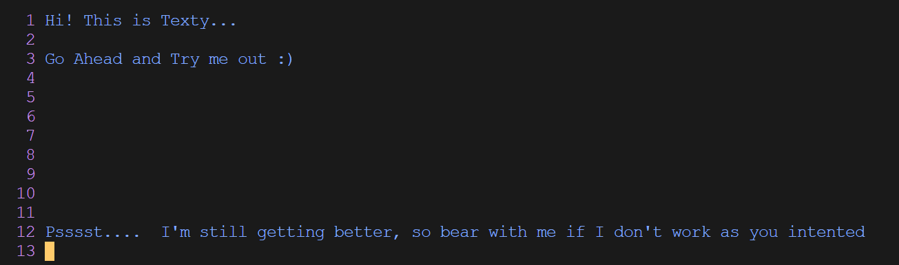

# Texty

A terminal-based Text Editor written in Go!
Inspiration for the editor- [Kilo Editor](https://github.com/antirez/kilo)

## INSTRUCTIONS

- To use this editor in your terminal, run `source install.sh` in your root directory.

- After that, you can simply run `texty` or `texty {filename}` to open and edit your file!

- If you are using WSL on windows and if you opened install.sh, ensure that your script uses Unix-style line endings (LF) rather than Windows-style line endings (CRLF). You can convert line endings using dos2unix if you have it installed.

  `dos2unix install.sh`

## COMMANDS

The default mode is non-editable, so you need to enter a command key:

- `i`:   to enter edit mode
- `esc`: to exit edit mode
- `w` :  to save the file
- `q` :  to quit the editor

## FEATURES

You can customize your editor theme by modifying the `config.json` file.

(Did you notice you don't need to close the editor to apply new colors? Cool, right?)

The following colors are available:

    blue
    lightblue
    green
    lightgreen
    black
    default
    magenta
    lightmagenta
    red
    lightred
    white

P.S. In the config file, `fg` stands for `foreground` and `bg` stands for `background`.

## WORK IN PROGRESS

- Getting better at keyboard event recognition
- Moving away from using TermBox and have more fine-grained control over raw-input
- Having more text-editor features like moving cursor to start of line, to end of line etc.
- Implementing search and replace functionality
